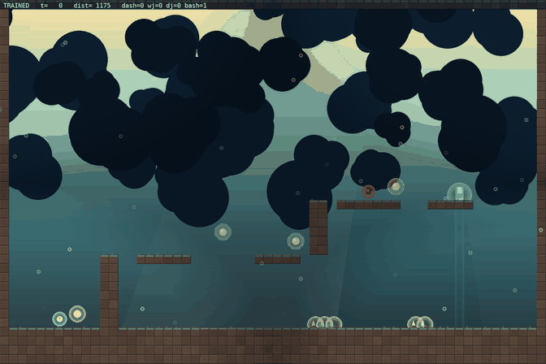

# ori-park — Ori-style movement physics + adversarial RL tag game

A from-scratch 2D physics engine that recreates the **movement model of Ori
and the Will of the Wisps**, wrapped in a vectorized gymnasium environment,
trained by a **self-play league of two adversarial neural-network policies**
(an agile evader vs a pursuer), with a **third adversarial learner** (a CEM
level generator) that keeps the curriculum at the edge of the agents' skill.

> **Untrained vs trained evader, same arena, same chaser** (untrained
> wanders and times out; the trained evader escapes through the light
> portal in ~6 seconds):
>
> 
>
> Escape rate over self-play training on fixed arenas: **0% (random) →
> 0-5% (early) → 23-54% (late) → 30% (final)** — see
> [docs/RESULTS.md](docs/RESULTS.md) and the
> [progress curve](docs/media/progress_curve.png).

```
              ┌─────────────────────────────────────────────────┐
              │  OriArenaVecEnv (vectorized numpy, 120 Hz phys) │
              │                                                 │
   evader ──► │  run · jump · double-jump · wall-jump · dash     │
   chaser ──► │  · bash-orbs · coyote time · input buffering    │
              └───────┬──────────────────────────┬──────────────┘
                      │                          │
        ┌─────────────▼──────────┐   ┌───────────▼─────────────┐
        │ PPO (evader policy)    │   │ PPO (chaser policy)     │
        │ trained vs chaser pool │   │ trained vs evader pool  │
        └────────────────────────┘   └─────────────────────────┘
                      │  self-play league: alternating blocks,
                      │  opponent snapshots, Elo ratings
                      ▼
        TerrainAdversary (CEM) ──► arena params ──► ArenaGenerator
        keeps evader win-rate ≈ 50%  (reachability-gated levels)
```

## What it recreates from Ori WotW

The game's signature feel comes from its movement *parameters*, which are
implemented faithfully (tuned in `oripark/config.py` → `MoveParams`):

| Ori WotW mechanic | Implementation |
|---|---|
| Snappy ground control / instant turns | 3600 px/s² accel, 4400 decel |
| Variable-height jump (hold = high, tap = low) | release cuts `vy` by 50% (`jump_cut`) |
| Jump buffering (press early, jump on land) | 0.15 s input buffer |
| Coyote time (jump just after leaving a ledge) | 0.10 s grace |
| Double jump (once per airtime) | `can_djump`, refreshed on landing; ground jump does **not** consume it |
| Wall slide | capped fall speed 170 px/s against walls |
| Wall jump (chainable) | 640 px/s horizontal kick + 900 px/s pop, 0.14 s re-stick grace |
| Dash (8 directions, momentum retention) | 1250 px/s burst for 0.12 s, post-dash bleed-off |
| Bash (launch off targets, refreshes dash+djump) | static orbs, 8-way aim, 1150 px/s launch, 0.22 s cooldown |
| Slight "float" while rising | gravity × 0.92 during ascent |

Arenas are tile-based (60×40, 32 px tiles) with a **path-first generator**:
it lays a canonical platform chain from spawn to the light portal, then
decorates with climb towers, spike pits, dash gaps and bash orbs. A coarse
**reachability BFS** (jump/double-jump/dash/wall-climb move model) gates
every level, so the adversarial generator can never propose an impossible
map.

## The three adversarial learners

1. **Evader (PPO)** — full Ori kit. Rewards: portal progress + rightward
   milestones (dense, un-gameable), a one-time bonus for passing the chaser,
   survival time, separation gain, agility usage (dash/wall-jump/
   double-jump/bash), +3 for escaping through the portal, penalties for
   being caught or hitting spikes, -3 for failing to escape before timeout.
2. **Chaser (PPO)** — same physics minus bash. Rewards mirror the evader's:
   closing distance, proximity, catching, penalty when the evader escapes.
3. **Terrain adversary (cross-entropy method)** — a small policy over the 6
   arena parameters (gap scale, tower height, spike probability, orb count,
   wander, dash-gap frequency). It is updated to keep the evader's win rate
   near 50%, so levels stay just past the agents' current skill — the
   classic asymmetric-self-play curriculum. It starts from easy levels and
   hardens only as the evader learns to win.

Self-play loop (`oripark/selfplay.py`): a **warmup phase** (both sides train
against random opponents so traversal/escape skills develop first), then
**alternating training blocks**. Each block trains one PPO against a snapshot
sampled from the opponent's league pool (60% latest, 40% older checkpoints —
prevents degenerate cycling). Latest-vs-latest evaluations update two-player
Elo ratings. Agility metrics (dashes, wall jumps, double jumps, bashes,
airtime, max traversal zone per episode) are logged per block and plotted.

## Run it

```bash
python3 -m venv .venv && ./.venv/bin/pip install -r requirements.txt

# quick smoke test (~1 min)
./.venv/bin/python train.py --quick

# real self-play run (defaults: 120 blocks, 16 parallel arenas)
./.venv/bin/python train.py --blocks 120 --out results/run1

# render demos: random baseline vs trained, same arena seed
./.venv/bin/python demo.py --run results/run1 --mode both --arena-seed 4242 --out demo.gif

# head-to-head eval report vs the untrained baseline (markdown)
./.venv/bin/python eval.py --run results/run1 --matches 40 --baseline
```

Outputs in `results/<run>/`: `blocks.jsonl` (per-block Elo/win-rate/agility),
`episodes.jsonl` (every episode), `curves.png` (learning curves),
`evader.zip`/`chaser.zip` (final policies), `pool_ev_*.pt`/`pool_ch_*.pt`
(league snapshots — `evader_init.pt` is the untrained baseline for
before/after demos), `adv_mu.npy` (final terrain-adversary parameters).

## Structure

```
train.py / demo.py / eval.py      CLI entry points
oripark/
  config.py       MoveParams / EnvParams / TrainParams
  physics.py      vectorized Ori-style movement + tile collision
  arena.py        path-first procedural levels + reachability BFS
  env.py          OriArenaVecEnv (stable-baselines3 VecEnv, no subprocesses)
  adversaries.py  TerrainAdversary (CEM) + StaticSampler
  selfplay.py     self-play league: alternating PPO blocks, pools, Elo
  metrics.py      JSONL logging + matplotlib curves
  render.py       headless pygame replay -> GIF / ASCII replay
```

## Notes & extensions

- The physics is Ori-**inspired**, not a copy of the game's binaries/assets
  (no extraction — everything is re-implemented and tunable).
- Next steps that fit this codebase: bash-target projectiles, wall-grapple,
  multi-agent evader teams, PPO with recurrent policies, or a pixel-based
  CNN observation if you want the agents to see rather than read state.
