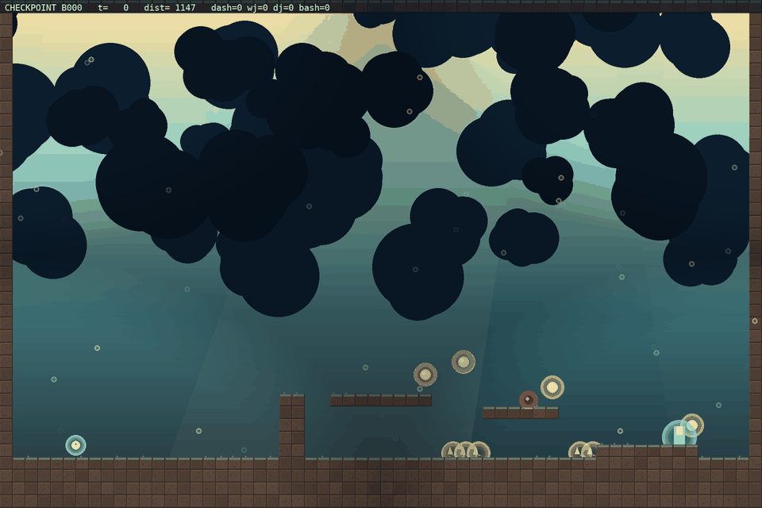

# Tournament — evader policies vs the frozen chaser

Run: `results/run17` · 30 fixed arenas (adversary mean `[0.17 0.55 0.92 0.11 0.22 0.08]`) · 60 matches each · stochastic evader, deterministic chaser (the honest PPO protocol).

| rank | entrant | escape rate | caught | avg len |
|---|---|---:|---:|---:|
| 1 | scripted expert | 83% (50/60) | 7 | 188 |
| 2 | checkpoint b130 | 48% (29/60) | 31 | 174 |
| 3 | BC-pretrained | 45% (27/60) | 33 | 279 |
| 4 | checkpoint b260 | 40% (24/60) | 36 | 164 |
| 5 | checkpoint b000 | 38% (25/65) | 30 | 335 |
| 6 | checkpoint b090 | 38% (23/60) | 37 | 185 |
| 7 | random-init | 37% (22/60) | 38 | 185 |
| 8 | checkpoint b299 | 37% (22/60) | 38 | 166 |
| 9 | final/best | 37% (22/60) | 38 | 166 |
| 10 | checkpoint b040 | 35% (21/60) | 39 | 188 |
| 11 | checkpoint b210 | 35% (21/60) | 39 | 169 |
| 12 | checkpoint b170 | 25% (15/60) | 45 | 176 |

## Recorded videos

Each entrant plays the same arena (seed 5100) with the same chaser; the clip shows its natural behavior. Watch the arc: random flails, BC traverses, checkpoints gain evasion, the best checkpoint escapes.

### #2 checkpoint b130 — escaped

### #3 BC-pretrained — ch_hazard

### #4 checkpoint b260 — escaped

### #5 checkpoint b000 — ch_hazard

### #6 checkpoint b090 — timeout

### #7 random-init — caught

### #8 checkpoint b299 — caught

### #9 final/best — caught

### #10 checkpoint b040 — caught

### #11 checkpoint b210 — caught

### #12 checkpoint b170 — caught

## Reading the table

- **random-init**: the untrained policy — lower bound.
- **BC-pretrained**: the scripted expert's traversal cloned into the NN.
- **checkpoint bN**: evader mid-training (self-play is non-stationary, so the best checkpoint often beats the final block).
- **final/best**: `evader.zip` (select.py output).
- **scripted expert**: reference player (BFS waypoint + flee), not an NN.

Escape rate is measured on the run's own (hard) arena distribution, so numbers are comparable within a run but not across runs with different adversary means.
---

## run18 comparison (`results/run18`, gap-sprinkling + 512² net)

The same tournament on run18's checkpoint line: **the BC'd policy (b000)
tops the table at 60%** on the run's own (drifted) terrain, and the
scripted expert collapses to 2% — the gap-sprinkling curriculum changed
the terrain enough that neither the expert's waypoints nor the final RL
policy fit it. On the hard-arena protocol the run18 best (b340) ties
run17 (26%) — see [RESULTS.md](RESULTS.md) E12 for the negative result.

Full table: [tournament_run18.md](tournament_run18.md), videos in
`docs/media/tournament_run18/`.
