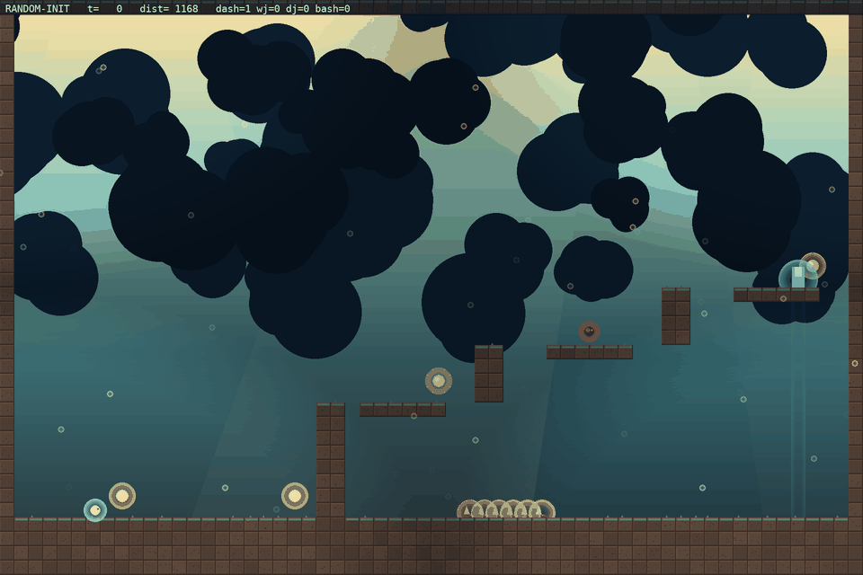

# Tournament — evader policies vs the frozen chaser

Run: `results/run18` · 30 fixed arenas (adversary mean `[0.58 0.22 0.46 0.16 0.3  0.06]`) · 60 matches each · stochastic evader, deterministic chaser (the honest PPO protocol).

| rank | entrant | escape rate | caught | avg len |
|---|---|---:|---:|---:|
| 1 | checkpoint b000 | 60% (36/60) | 24 | 188 |
| 2 | checkpoint b060 | 47% (28/60) | 32 | 116 |
| 3 | checkpoint b399 | 45% (27/60) | 33 | 161 |
| 4 | checkpoint b230 | 40% (24/60) | 36 | 143 |
| 5 | BC-pretrained | 38% (23/60) | 37 | 205 |
| 6 | random-init | 35% (21/60) | 39 | 156 |
| 7 | checkpoint b290 | 35% (21/60) | 39 | 136 |
| 8 | checkpoint b170 | 33% (20/61) | 41 | 113 |
| 9 | checkpoint b110 | 30% (18/60) | 42 | 104 |
| 10 | checkpoint b340 | 30% (18/60) | 42 | 122 |
| 11 | final/best | 30% (18/60) | 42 | 122 |
| 12 | scripted expert | 2% (1/60) | 10 | 85 |

## Recorded videos

Each entrant plays the same arena (seed 5100) with the same chaser; the clip shows its natural behavior. Watch the arc: random flails, BC traverses, checkpoints gain evasion, the best checkpoint escapes.

### #1 checkpoint b000 — escaped

### #2 checkpoint b060 — caught

### #3 checkpoint b399 — caught

### #4 checkpoint b230 — escaped

### #5 BC-pretrained — caught

### #6 random-init — escaped

### #7 checkpoint b290 — timeout

### #8 checkpoint b170 — escaped

### #9 checkpoint b110 — timeout

### #10 checkpoint b340 — caught

### #11 final/best — caught

## Reading the table

- **random-init**: the untrained policy — lower bound.
- **BC-pretrained**: the scripted expert's traversal cloned into the NN.
- **checkpoint bN**: evader mid-training (self-play is non-stationary, so the best checkpoint often beats the final block).
- **final/best**: `evader.zip` (select.py output).
- **scripted expert**: reference player (BFS waypoint + flee), not an NN.

Escape rate is measured on the run's own (hard) arena distribution, so numbers are comparable within a run but not across runs with different adversary means.