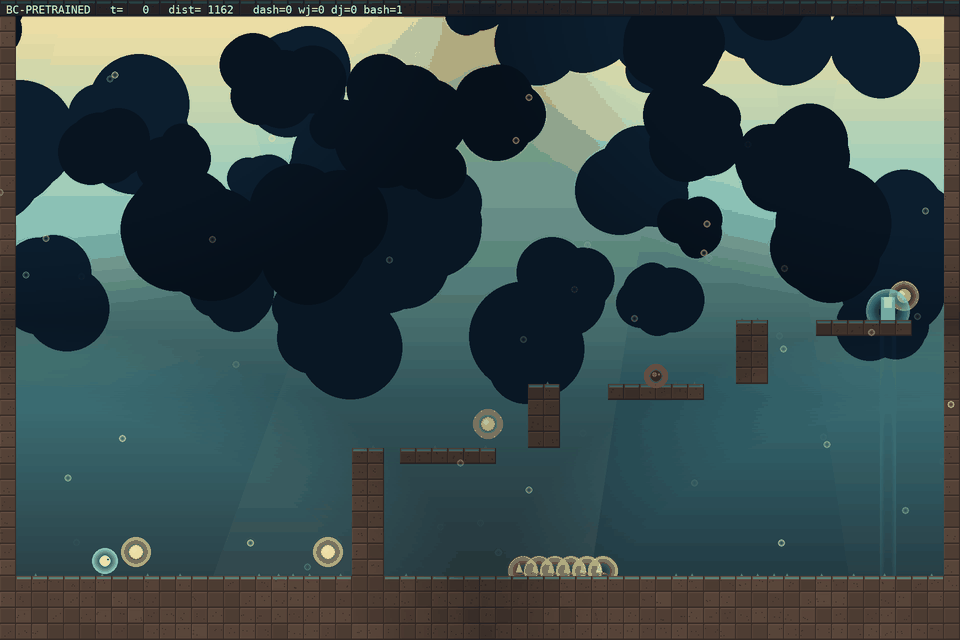

# Tournament — evader policies vs the frozen chaser

Run: `results/run19` · 30 fixed arenas (adversary mean `[0.88 0.07 0.07 0.3  0.27 0.49]`) · 60 matches each · stochastic evader, deterministic chaser (the honest PPO protocol).

| rank | entrant | escape rate | caught | avg len |
|---|---|---:|---:|---:|
| 1 | scripted expert | 87% (52/60) | 1 | 211 |
| 2 | checkpoint b210 | 68% (41/60) | 19 | 191 |
| 3 | checkpoint b260 | 63% (38/60) | 22 | 188 |
| 4 | checkpoint b170 | 60% (36/60) | 24 | 199 |
| 5 | random-init | 53% (32/60) | 28 | 194 |
| 6 | checkpoint b299 | 53% (32/60) | 28 | 224 |
| 7 | checkpoint b130 | 50% (30/60) | 30 | 165 |
| 8 | checkpoint b040 | 42% (25/60) | 35 | 206 |
| 9 | final/best | 37% (22/60) | 38 | 182 |
| 10 | checkpoint b090 | 35% (21/60) | 39 | 165 |
| 11 | BC-pretrained | 33% (20/60) | 40 | 214 |
| 12 | checkpoint b000 | 33% (20/60) | 40 | 215 |

## Recorded videos

Each entrant plays the same arena (seed 5100) with the same chaser; the clip shows its natural behavior. Watch the arc: random flails, BC traverses, checkpoints gain evasion, the best checkpoint escapes.

### #2 checkpoint b210 — escaped

### #3 checkpoint b260 — caught

### #4 checkpoint b170 — escaped

### #5 random-init — escaped

### #6 checkpoint b299 — escaped

### #7 checkpoint b130 — escaped

### #8 checkpoint b040 — escaped

### #9 final/best — escaped

### #10 checkpoint b090 — escaped

### #11 BC-pretrained — caught

### #12 checkpoint b000 — escaped

## Reading the table

- **random-init**: the untrained policy — lower bound.
- **BC-pretrained**: the scripted expert's traversal cloned into the NN.
- **checkpoint bN**: evader mid-training (self-play is non-stationary, so the best checkpoint often beats the final block).
- **final/best**: `evader.zip` (select.py output).
- **scripted expert**: reference player (BFS waypoint + flee), not an NN.

Escape rate is measured on the run's own (hard) arena distribution, so numbers are comparable within a run but not across runs with different adversary means.