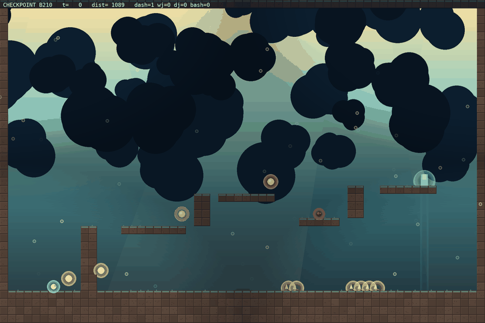

# Tournament — run20 (combined arena set, deterministic chaser)

> **Read this table with care.** run20's own chaser ended weak (final Elo
> 1180 vs run19's 1216), so this ranking was produced against **run19's
> stronger frozen chaser** (`--chaser-run results/run19`) to keep it
> meaningful. Even so, run20's chaos-lucky random init escapes 53% — the
> same draw that inflates every run20 baseline. The honest cross-chaser
> skill read is the 3×3 matrix in [RESULTS.md](RESULTS.md): run20 trained
> beats run17 trained on all three chasers (+4/+7/+20) but trails run19
> trained (row mean 40% vs 48%). Within-terrain, run20's checkpoints are
> tightly clustered (38-42%) with no single dominant champion; the
> 'random-init escaped' video below is the lucky-init draw, not skill.

Run: `results/run20` · 30 fixed arenas (adversary mean `[0.13 0.02 0.73 0.18 0.78 0.2 ]`) · 60 matches each · stochastic evader, deterministic chaser (the honest PPO protocol).

| rank | entrant | escape rate | caught | avg len |
|---|---|---:|---:|---:|
| 1 | scripted expert | 87% (52/60) | 1 | 211 |
| 2 | random-init | 53% (32/60) | 28 | 159 |
| 3 | checkpoint b130 | 53% (32/60) | 28 | 149 |
| 4 | BC-pretrained | 45% (27/60) | 33 | 204 |
| 5 | checkpoint b000 | 45% (27/60) | 33 | 214 |
| 6 | checkpoint b090 | 42% (25/60) | 35 | 153 |
| 7 | checkpoint b299 | 42% (25/60) | 35 | 184 |
| 8 | checkpoint b040 | 40% (24/60) | 36 | 180 |
| 9 | checkpoint b210 | 40% (24/60) | 36 | 162 |
| 10 | checkpoint b170 | 38% (23/60) | 37 | 156 |
| 11 | checkpoint b260 | 38% (23/60) | 37 | 157 |
| 12 | final/best | 38% (23/60) | 37 | 156 |

## Recorded videos

Each entrant plays the same arena (seed 5100) with the same chaser; the clip shows its natural behavior. Watch the arc: random flails, BC traverses, checkpoints gain evasion, the best checkpoint escapes.

### #2 random-init — escaped

### #3 checkpoint b130 — ev_hazard

### #4 BC-pretrained — ch_hazard

### #5 checkpoint b000 — escaped

### #6 checkpoint b090 — escaped

### #7 checkpoint b299 — escaped

### #8 checkpoint b040 — ev_hazard

### #9 checkpoint b210 — ev_hazard

### #10 checkpoint b170 — escaped

### #11 checkpoint b260 — escaped

### #12 final/best — escaped

## Reading the table

- **random-init**: the untrained policy — lower bound.
- **BC-pretrained**: the scripted expert's traversal cloned into the NN.
- **checkpoint bN**: evader mid-training (self-play is non-stationary, so the best checkpoint often beats the final block).
- **final/best**: `evader.zip` (select.py output).
- **scripted expert**: reference player (BFS waypoint + flee), not an NN.

Escape rate is measured on the run's own (hard) arena distribution, so numbers are comparable within a run but not across runs with different adversary means.